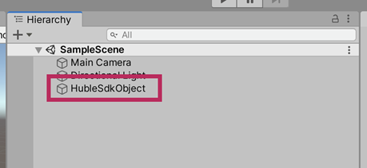
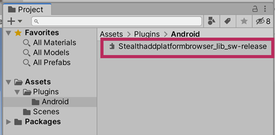
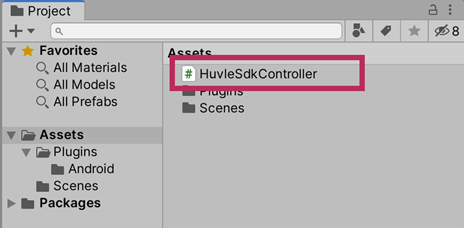
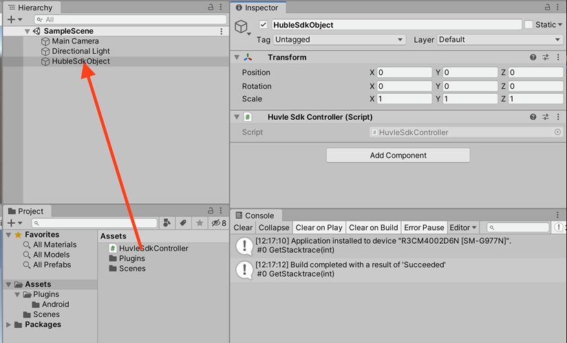
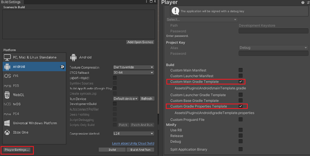

# HuvleView_SDK Unity3D install Guide

## Common Requirements
- Use above Unity 2020.3.25f1
- Above Google Play Service 20.5.0
- Android Target API 31

##  Huvleview Install Guide 
## Usage
### 1. Download HuvleSDK aar 
- [HuvleViewSDK 6.0.3.aar](https://sdk.huvle.com/repository/internal/com/byappsoft/sap/HuvleSDK/6.0.3/HuvleSDK-6.0.3.aar)

### 2. Create HuvleSdkObject to Hierarchy

1. Click [+] on Hierarchy panel
2. Click [Create Empty]
3. Change the name of created Object to HuvleSdkObject (No matter what the name is) 



### 3. Register Huvle SDK to Project

1. If ‘Plugins/Android’ is not existing below art of Assets, create the folder (Should distinguish name and uppercase lowercase actually)
2. Drag and drop the downloaded file to Assets/Plugins/Android folder and register it (HuvleSDK-6.0.3.aar is the file)



### 4. Create Huvle Script to Project

1. Click [+] on Project panel
2. Click [C# Script]
3. Change the name of created Script to HuvleSdkController (No matter what the name is)




### 5. Apply to Huvle Script
- HuvleSdkContorller.cs
```
using System.Collections;
using System.Collections.Generic;
using UnityEngine;
using System;

public class HuvleSdkController : MonoBehaviour
{
void OnApplicationFocus(bool hasFocus) {
        if (hasFocus) {
            CallHuvleOnResume();
        }
    }
    private void CallHuvleOnResume() { 
        try {
            AndroidJavaClass unity_player = new AndroidJavaClass("com.unity3d.player.UnityPlayer"); 
            AndroidJavaObject activity = unity_player.GetStatic<AndroidJavaObject>("currentActivity"); 
            AndroidJavaClass share_plugin = new AndroidJavaClass("com.byappsoft.sap.UnityInterface"); 
            activity.Call("runOnUiThread", new AndroidJavaRunnable(() => {
                share_plugin.CallStatic("onResume", activity);
            })); 
        } catch (Exception ex) {
            Debug.Log("CallHuvleOnResume error:" + ex.Message); 
        }
    }
}
```

### 6. Connect Huvle Script to Huvle Object

1. Drag Huvle Script created in 4 to Huvle Object created in 1



### 7. Unity Gradle Template 
1. [File]->[Build Settings]->[Player Settings…] and click the menu 
2. Open the Art [Publishing Settings] from the Art [Player]
3. Check the art of [Custom Main Gradle Template] , [Custom Gradle Properties Template] on [Build] category.
4. Choose [Other settings] Minimum API Level 4.4, Target API Level android12(API Level31)




### 8. Revise Custom Main Gradle Template 
1. When you create Unity Gradle Template, mainTemplate file is created in Assets/Plugins/Android folder of Project panel.
2. Open mainTemplate file with an editor and add it to dependencies as follows. (appcompat, support-v4, play-services-ads)


```
.
.
dependencies {
    implementation fileTree(dir: 'libs', include: ['*.jar'])

    implementation 'com.android.support:appcompat-v7:28.0.0'
    implementation 'com.android.support:support-v4:28.0.0'
    implementation 'com.google.android.gms:play-services-ads:20.5.0'

**DEPS**}
.
.
```

### 9. Custom Gradel Properties Template Revise (androX)
1. gradleTemplate file is created in Assets/Plugins/Android folder of Project panel.
2. Open GradleTemplate with editor and add it as follows.
(android.enableJetifier=true , android.useAndroidX=true  )

```
org.gradle.jvmargs=-Xmx**JVM_HEAP_SIZE**M
org.gradle.parallel=true

android.enableJetifier=true // add
android.useAndroidX=true // add

android.enableR8=**MINIFY_WITH_R_EIGHT**
unityStreamingAssets=.unity3d**STREAMING_ASSETS**
**ADDITIONAL_PROPERTIES**
```

### 10. Notice
- When you implement and exit your app after integration of HuvleSDK with Unity, Notification-bar will be re-shown up. Please refer to this Notice.

- Since this is based on the version after Unity 2020.3.25f1, integration way with the other below versions could be different. If you have any issue to integrate, please don’t hesitate to contact us. 


## License
Huvle Corporation owns the copyright on HuvleView SDK.
```
Huvle SDK Android
Copyright 2021-present Huvle Corp.

Unauthorized use, modification and redistribution of this software are strongly prohibited.
```

